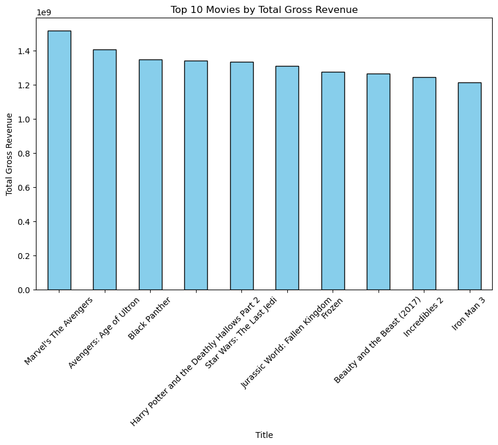
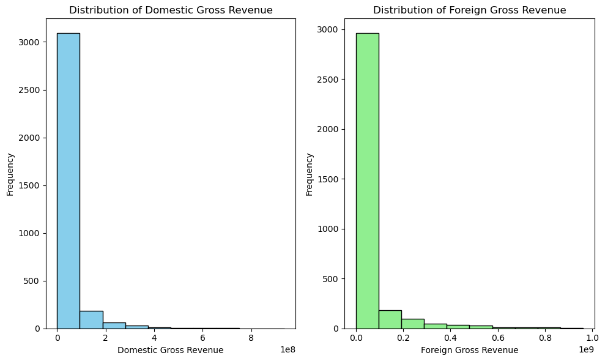
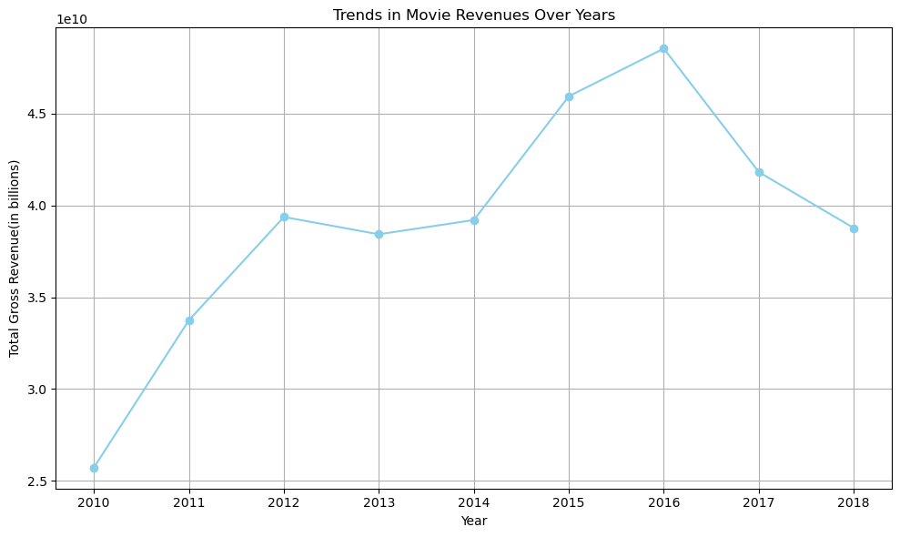

# Movie Analysis Project

## Overview
This project aims to analyze the movie dataset based on their domestic and foreign gross revenue,production studios and release years and provide insights on what type of films to create.

## Business Understanding
### Stakeholder
- Microsoft Corporation

### Key Business Questions 
1. What key factors contribute to the financial success of movies?
2. What movies produce highest grossing revenues?
3. Which Studios produce the highest grossing movies?
4. What are the trends in revenues over thet years?
5. What recommendations and insights can be provided fr movie production and market strategies?

## Data Understanding and Analysis
### Source of Data
The dataset used in this project consists of movie revenue data collected from various sources, including Box Office Mojo, IMDb, and other movie industry databases.

### Description of Data
- **Title**: Name of the movies(categorical)
- **Studio**: Name of the studio that produced the movie(categorical)
- **Domestic Gross**: Revenue from domesctic markets(numerical)
- **Foreign Gross**: Revenue from foreign markets(numerical)
- **Year**: Year of release of movies(numerical)

### Visualizations
1. **Movie Revenue Analyis**
   
Insights of the Visuaization:
- Interpretation of the Visualization:
- The top movies have high grossing total revenues.
- The revenues of these movies are relatively close to each other indicating a consistently high performance among them.
- Many of the top grossing movies are part of popular franchises such as Marvel, Star Wars.
- Most top grossing movies belong to action and fantasy genres indicating their profitability and popularity.

2. **Revenue Distribution of Foreign and Domestic Gross**

 Insights of the visualization:
- Both domestic and foreign gross revenue distributions are right skewed.
- Most movies earn a relatively low gross revenue while a small number earn very high gross revenues.
- The domestic gross revenue shows that most movies earn less than 200 million dollars. The foreign gross revenue shows that most movies earn less than 400 million dollars.This suggests that most movies earn more in foreign markets than domestic market.
- There are few movies with high gross revenues shown by the outliers on the right side of both histograms which contributes significantly to the total revenue.

3. **Domestic Gross Vs Foreign Gross**

Insights of the Visualization:
- There is a positive correlation between domestic and forign gross revenues meaning movies that perform well domestically tend to also perform well in foreign markets.
- A majority of the movies cluster in the lower range of both domestic and foreign revenues with few movies in the higher range.
- There are several outliers with high revenues in both revenues that earn more than the average. 

4. **Top Grossing Studios**
  
  Interpretation of the Visualization:
- Buena Vista(BV) and Warner Bros(WB) are the leading top studios in terms of gross revenues indicating a strong portfolio of successful movies.
- There is a gap between the highest grossing studios and those on the lower end suggesting a concentration of market power among few studios.
- Successful studios tend to perform well in both domestic and international markets.

5. **Trend in Movie Revenue Over Years**
  
Interpretation of Visualization.
- There is a clear increase in total gross revenue from 2010 to 2016 indication growth during that period.
-  The highest total gross revenue was 2016 showing that was a successful year in the movie industry.
- There is a noticeable decrease in total gross revenue from 2016 going forward with a significant drop in 2017 to 2018 indicating a downward trend in growth in the last years of the dataset.

## Conclusion 

### Summary of Conclusion
1. Most top grossing movies belong to action and fantasy genres indicating their popularity and profitability.
1. High-grossing movies tend to focus their marketing and distributions internationally and use large production studios.
2. There is a  significant positive correlation between domestic and foreign gross revenues.
3. Beuna Vista and Warner Bros are leading in highest grossing movies.
4. Movie revenues generally increase over time with noticeable peaks during major releases ie in 2016
   
### Recommendations
- Invest on action and fantasy genres since their movies tend to have high grossing revenues.
- Focus on International Markets since movies tend to earn more in foreign markets. Microsoft shoud conduct reasearch to understand what types of movies resonate with both international and domestic audiences.
- Study strategies of the top grossing studios since they could yield high returns.
- Analyze the best times for movie releases to maximize revenue.
- Optimize marketing strategies like co-productions and partnerships with succcessful studios.
  
## Contact Information
- **Name**: [Angela Kalelwa]
- **LinkedIn**:[http://linkedin.com/in/angela-kalelwa-69744a212]
- **Email** [angiekale.kale@gmail.com]
  
Thank You for viewing this analysis. Please feel free to reach out for any questions or comments.

[Notebook](https://github.com/AngelaKalelwa/DS_PROJECTS/blob/master/first_project/index.ipynb)

